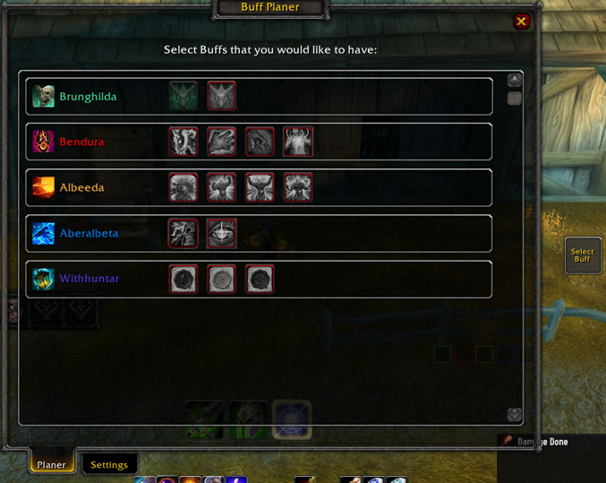
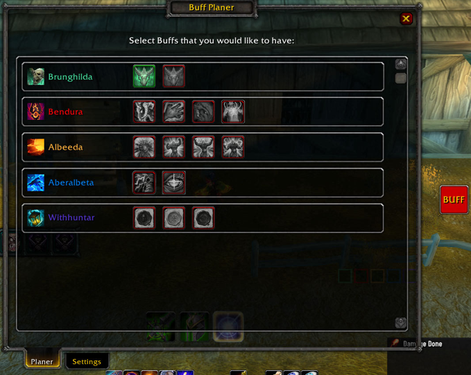
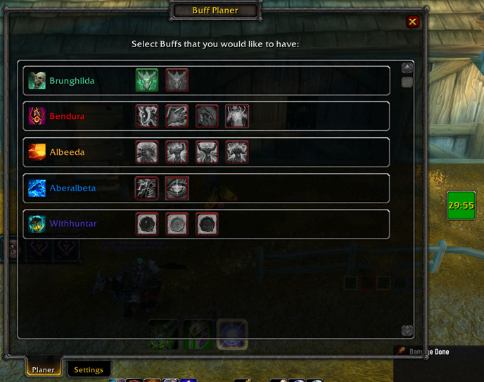
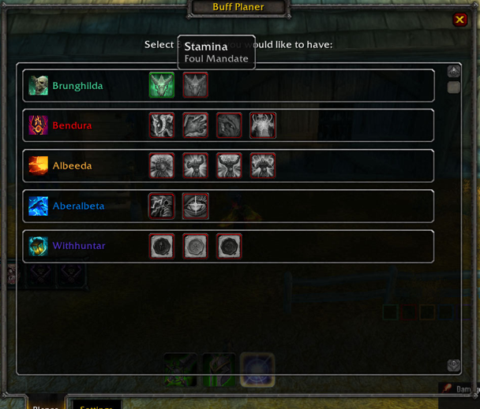
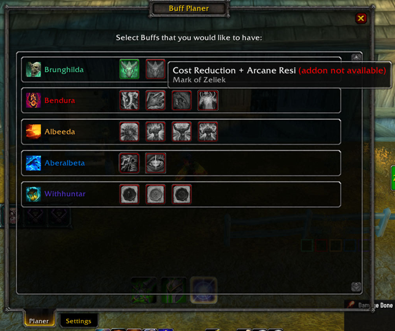
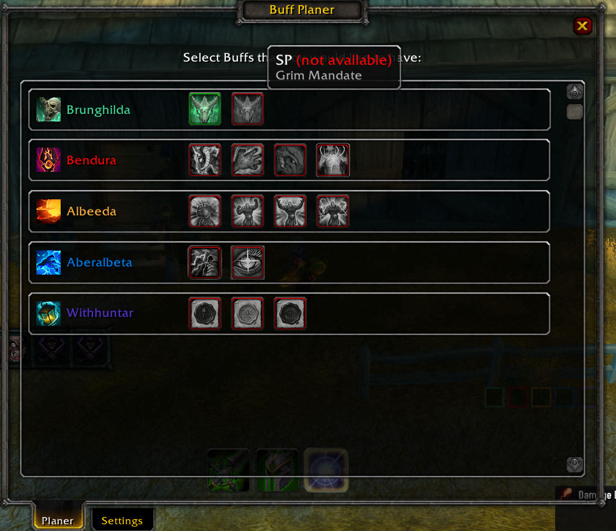

## Tired of not getting the buffs you need - or getting buffs that aren't useful to you?
### Tired of constantly asking other players which buffs they want?

**Buff Planner** solves these problems in a simple and convenient way!

Simply open Buff Planner by clicking the button near your minimap or by typing `/bp`. You will see all of your party members along with the buffs they can provide.

Hover over a buff to see exactly what it does, then select **one buff from each player** that you would like to receive. That's it!

Whenever another player selects one of your buffs, you will see a **BUFF** button. Simply click it, and Buff Planner will automatically determine which player needs which buff and cast it on them.

Once all requested buffs have been applied, the same button will display the **remaining duration of the buff that expires soonest**.

### Images

### What Buffs Does Buff Planner Handle?

Buff Planner focuses on **buffs where there is an actual choice between different options**.

For example, if a player can provide three buffs - **A, B, and C** - and **A and B are mutually exclusive options**, while **C can be applied independently alongside either A or B**, only **A and B** will be displayed in Buff Planner.

Independent buffs like **C** are intentionally not included, because they don't require any choice or coordination between players. These buffs can simply be applied separately whenever needed.

This keeps Buff Planner focused on the buffs that actually require coordination, while avoiding unnecessary clutter from buffs that can be handled independently.

### How to Install

1. Download the addon by clicking the green **`<> Code`** button and selecting **Download ZIP**.
2. Extract the downloaded ZIP file.
3. Open the extracted folder.
4. Rename `Buff-Planer-main` to `BuffPlanner`.
5. Copy the `BuffPlanner` folder into your `Interface/Addons` folder.
6. Make sure the final folder structure looks like this:

   `Interface/Addons/BuffPlanner/`

   Inside the `BuffPlanner` folder, you should see files such as `BuffPlanner.lua`, `BuffPlanner.toc`, etc.

### How Does It Work?

When another player (or you) selects one of your buffs and that player is within range, Buff Planner checks whether they already have the requested buff.

If they don't, the **BUFF** button will turn red.

Clicking the button will buff the appropriate player. Buff Planner will then immediately check whether any other nearby party members are still missing one of their requested buffs.

- If someone still needs a buff, the **BUFF** button remains red.
- If everyone in range has received their requested buffs, the button will display a countdown showing the remaining duration of the buff that will expire first.

### Want to Prioritize a Specific Player?

Simply target the player and click the **BUFF** button.

Buff Planner will automatically detect which buff that player has requested from you and cast it on them first.

### Move BUFF Button?

To move BUFF / Select Buff button you need to press 'alt' + left click & drag it.

### Why Is a Buff Red?

Buff Planner shows you all the buffs that your party members can potentially provide.

If a buff is highlighted in **red**, it means that the corresponding player has not installed this addon or has not learned that buff and therefore cannot provide it. These buffs cannot be selected. If you hover this buff, you will see more info.

### Additional Settings

Additional options and customization can be found in the **Settings** tab below.

### Chat Commands

You can use either `/bp` or `/buffplanner` to interact with the addon:

- `/bp` or `/bp config` — Opens the main configuration window (Planner/Settings).
- `/bp buffbutton` — Toggles the visibility of the main **BUFF** button.

### FAQ

**Q: Is Buff Planner useful if some party members don't have the addon?**

**A:** Partially. You can still see all the available buffs that your teammates can provide and select the ones you want. You will then need to ask them manually for the buffs.

However, the real power of Buff Planner comes when **all or most party members are using the addon**. That's when the buff requests and buffing process can happen automatically.

---

**Q: Why aren't all buffs from my class or other classes displayed?**

**A:** Buff Planner is designed to display only buffs where there is an actual choice between different options.

For example, if a player can provide three buffs: **A, B, and C**, and **A and B are mutually exclusive options**, while **C can be applied independently in addition to either A or B**, only **A and B** will be displayed in Buff Planner.

Buffs like **C**, which can be applied independently and do not conflict with or replace any other buff, are intentionally not shown. These buffs need to be handled manually by the players.

---

**Q: Is Buff Planner designed to be used in raids?**

**A:** No - not at the moment. I haven't even tested it in a raid yet. The main purpose of this addon is to make buff management easier in **small groups, such as M+**.

---

**Q: Will Buff Planner be reworked to support raids in the future?**

**A:** Maybe! I haven't really thought about it yet, but it's definitely something that could be added in the future.

---

**Q: Is the addon stable?**

**A:** I hope so! 😄

I'm not an expert addon developer, and I had to manually add **47 different buffs**, including their icons, spell names, and other information. I've tested some of them, but not every single one.

So there may still be some bugs or edge cases. If you encounter something that doesn't work correctly, please let me know!

## ❤️ Support Buff Planner

If you enjoy using Buff Planner and would like to support its development, you can do so through GitHub Sponsors or PayPal.

- [💜 GitHub Sponsors](https://github.com/sponsors/Aberalgama)
- [💙 PayPal](https://paypal.me/svSalzmannViktor)

Every contribution is greatly appreciated and helps support further development of the addon!